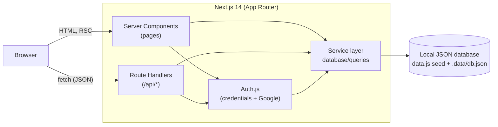
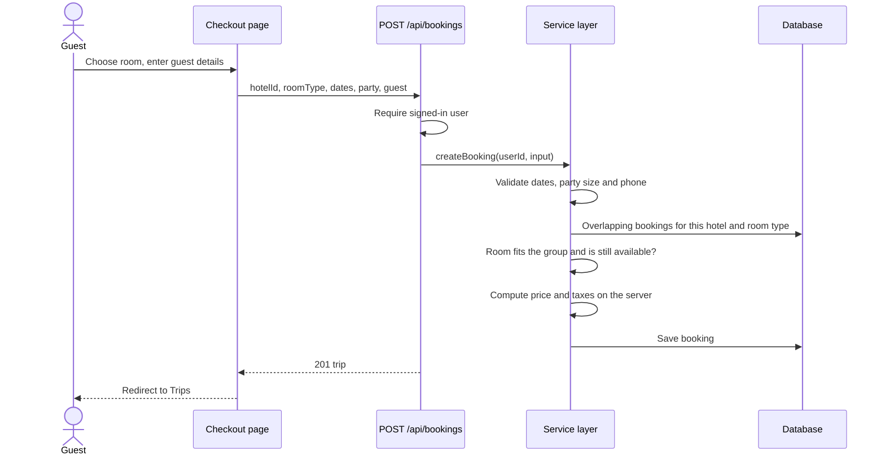

<div align="center">

# StaySwift

**A full-stack hotel booking platform: search, compare rooms, book, review and manage trips.**


</div>

StaySwift is a Next.js 14 application whose UI follows the stays flow of large travel sites: destination and date search, filterable results, room selection with live availability, checkout, reviews and a trips dashboard.

It is built around a **swappable data layer**. All data access and business rules live in one service module, backed today by a local JSON database and exposed through a documented REST API, so the storage can be replaced by a real database or a separate backend (for example ASP.NET Core) without touching the UI.

## Contents

- [Features](#features)
- [Architecture](#architecture)
- [Getting started](#getting-started)
- [Configuration](#configuration)
- [Project structure](#project-structure)
- [Domain rules](#domain-rules)
- [REST API](#rest-api)
- [Security](#security)
- [Replacing the local database](#replacing-the-local-database)
- [Troubleshooting](#troubleshooting)
- [Known limitations](#known-limitations)
- [Roadmap](#roadmap)
- [Contributing](#contributing)

## Features

**Search and discovery**
- Destination search with type-ahead suggestions, date picker and a rooms, adults and children selector
- Filters for property name, price per night, guest rating, star rating and amenities; sorting by recommendation, price, guest rating or stars
- All search state lives in the URL, so a result page can be shared, bookmarked or reloaded
- Home page with trending destinations and top-rated stays

**Hotel pages**
- Photo gallery, description, amenities with hours and prices, and policies
- Standard, Deluxe and Suite rooms with live availability ("Only 2 left") and the total price for the chosen dates
- Guest reviews with a score out of 10

**Booking and trips**
- Checkout with guest details, an itemised price (rooms, nights, taxes and fees) and the cancellation deadline
- Availability is re-checked on the server at booking time, so a room cannot be double-booked
- Trips dashboard with Upcoming, Past and Cancelled tabs and one-click cancellation until the day before check-in
- Reviews only from guests whose stay has started, one per hotel

**Accounts**
- Email and password registration and sign-in, with bcrypt-hashed passwords
- Optional Google sign-in
- Return-to-page after sign-in (for example back to checkout)

## Architecture



Pages render on the server and call the service layer directly. Interactive actions in the browser (book, cancel, review, register) call the REST endpoints, which call the same service functions. Business rules therefore exist exactly once.

**Booking flow**



## Getting started

### Prerequisites

- Node.js 18.17 or later
- npm

### Install and run

```bash
git clone https://github.com/your-username/stayswift.git
cd stayswift
npm install
```

Create a `.env` file in the project root:

```env
AUTH_SECRET=replace-with-a-long-random-string   # generate with: npx auth secret
GOOGLE_CLIENT_ID=                               # optional
GOOGLE_CLIENT_SECRET=                           # optional
```

```bash
npm run dev
```

Open <http://localhost:3000>.

### Demo account

The seed data includes a guest with upcoming, past and cancelled trips and a past stay you can review.

| Email | Password |
|---|---|
| `demo@stayswift.com` | `password123` |

Every `@example.com` user in the seed data shares that password.

### Scripts

| Command | Description |
|---|---|
| `npm run dev` | Development server with hot reload |
| `npm run build` | Production build |
| `npm start` | Serve the production build |
| `npm run lint` | ESLint (`next/core-web-vitals`) |

## Configuration

| Variable | Required | Description |
|---|---|---|
| `AUTH_SECRET` | Yes | Secret used to sign session tokens. Use a long random value and keep it private. |
| `GOOGLE_CLIENT_ID` | No | Google OAuth client id. Enables "Continue with Google". |
| `GOOGLE_CLIENT_SECRET` | No | Google OAuth client secret. |

To enable Google sign-in, create an OAuth client in the Google Cloud console and add `http://localhost:3000/api/auth/callback/google` as an authorized redirect URI (plus your production URL when you deploy).

`.env` is git-ignored. Never commit secrets.

## Project structure

```
app/
  layout.js            Root layout and metadata
  (home)/              Public pages: home, search, hotel details, checkout, trips
  (auth)/              Sign in and register
  api/                 REST route handlers; _lib/http.js holds shared helpers
components/            UI grouped by feature: hotel, search, payment, home, auth, user
database/
  local/data.js        Seed data (hotels, amenities, users, reviews, bookings)
  local/db.js          JSON storage: load, save, id generation
  queries/index.js     Service layer: every read, write and business rule
  utils/stay.js        Pure helpers: dates, room types, pricing, scores, formatting
docs/API.md            Full REST API reference
auth.js                Auth.js configuration
```

### Design decisions

- **One service layer.** Pages and API routes both call `database/queries`. Rules such as availability, pricing and cancellation are never duplicated.
- **Pure helpers are separate.** `database/utils/stay.js` has no I/O, so the same file runs on the server and in the browser and is easy to port or test.
- **URL as state.** Search, filters and sorting are query parameters. Results render on the server, can be linked to, and need no client state store.
- **Server-calculated prices.** Clients never send a price. The server derives it from the hotel's rates, the dates and the party.
- **Consistent errors.** Every API error is `{ "error": "message" }` with a meaningful HTTP status, handled in one wrapper (`app/api/_lib/http.js`).

## Domain rules

| Rule | Behaviour |
|---|---|
| Room types | Standard (sleeps 2, 5 rooms) at the hotel's low rate; Deluxe (sleeps 3, 3 rooms) at the average of low and high; Suite (sleeps 4, 2 rooms) at the high rate |
| Availability | Rooms left = room inventory minus rooms in non-cancelled bookings of that type whose stay overlaps the dates |
| Overlap | `existing.checkin < checkout` and `existing.checkout > checkin`, so same-day checkout and check-in do not conflict |
| Group fit | `ceil((adults + children) / rooms) <= sleeps`, with at least one adult per room; up to 8 rooms, 16 adults and 8 children |
| Dates | Check-in from today or later and check-out after check-in; invalid dates are ignored in search and rejected when booking |
| Price | `rate × nights × rooms`, plus 10% taxes and fees rounded to the nearest dollar |
| Score | Average review rating (1 to 5) × 2, shown out of 10 with one decimal |
| Cancellation | Free until the day before check-in |
| Reviews | One per guest per hotel, only with a non-cancelled booking whose check-in has arrived |

## REST API

The full contract (parameters, request bodies, response shapes, error codes) is in [docs/API.md](docs/API.md).

| Method | Route | Auth | Purpose |
|---|---|---|---|
| GET | `/api/destinations` | – | Cities with stay counts and a photo |
| GET | `/api/amenities` | – | Amenity catalogue |
| GET | `/api/hotels` | – | Search with filters, sorting and pricing |
| GET | `/api/hotels/featured` | – | Top-rated hotels |
| GET | `/api/hotels/:id` | – | Hotel details |
| GET | `/api/hotels/:id/rooms` | – | Room options with availability and price |
| GET | `/api/hotels/:id/reviews` | – | Reviews, newest first |
| POST | `/api/hotels/:id/reviews` | Yes | Post a review |
| GET | `/api/bookings` | Yes | Own trips, optionally by status |
| POST | `/api/bookings` | Yes | Create a booking |
| GET | `/api/bookings/:id` | Yes | One trip |
| PATCH | `/api/bookings/:id` | Yes | Cancel a booking |
| POST | `/api/auth/register` | – | Create an account |
| GET | `/api/users/me` | Yes | Current user |

Example:

```bash
curl "http://localhost:3000/api/hotels?destination=Paris&checkin=2026-12-01&checkout=2026-12-04&adults=2&sort=price_asc"
```

## Security

- Passwords are hashed with bcrypt (cost 10) and are never returned by any endpoint.
- Sessions are signed JWTs managed by Auth.js, in `HttpOnly` cookies.
- Booking, cancelling and reviewing require a signed-in user. The user always comes from the session, never from the request body.
- A user can only read or cancel their own bookings. Other people's bookings return `404`.
- Prices are computed on the server; availability is re-checked when a booking is created.
- The `callbackUrl` used after sign-in is restricted to same-site paths, so a crafted link cannot redirect people to another site.
- Search text is escaped before it is turned into a pattern.
- Card details are validated for format in the browser only and are never sent to the server or stored.

## Replacing the local database

The UI never touches storage directly, so the swap is contained:

1. **Keep the contract.** Implement the endpoints in [docs/API.md](docs/API.md) in the new backend (for example ASP.NET Core) with the same routes, bodies and response shapes. The "Domain rules" above are the behaviour to reproduce.
2. **Point the service layer at it.** Rewrite the functions in `database/queries/index.js` to call the new API (`fetch`) instead of reading `db.js`. Their names, arguments and return shapes stay the same, so pages and components do not change.
3. **Move authentication.** Replace the credentials check in `auth.js` (`verifyCredentials`) with a call to the new backend's login, and send its token with the calls in step 2.
4. **Switch the browser calls.** The forms call `/api/*` on the same origin. Keep those handlers as thin proxies, or point the forms at the new API URL.
5. **Model the data.** Ids are 24-character strings today; use whatever your database prefers and keep them as strings in JSON. Room types are derived from hotel rates in `database/utils/stay.js`; a real backend should store them per hotel.
6. **Remove** `database/local` and `.data` once nothing imports them.

## Troubleshooting

| Problem | Fix |
|---|---|
| Sign-in fails with a configuration error | `AUTH_SECRET` is missing from `.env`. Add it and restart the dev server. |
| "Continue with Google" fails | Set both Google variables and add the redirect URI shown under [Configuration](#configuration). |
| Data looks wrong or you want a clean slate | Delete `.data/db.json`, or raise `version` in `database/local/data.js`, and reload. |
| New bookings or reviews are not saved | The app needs a writable project folder; check file permissions for `.data`. |
| A hotel shows "No photo" | Its external image link has expired. Replace the URL in `database/local/data.js`. |
| Port 3000 is in use | Run `npm run dev -- -p 3001`. |

## Known limitations

- **Storage.** The local database writes to the `.data` folder. It suits development and demos, but not hosts with a read-only file system, and it is not safe with several server instances at once. Production use needs a real database.
- **Payments.** Checkout is a demo; no payment is processed.
- **No rate limiting** on sign-in and registration yet.
- **No email.** Booking confirmations are not sent.
- **Photos** come from an external CDN and some links have expired.
- **Tests.** There is no automated test suite yet.

## Roadmap

- [ ] Real database and backend behind the existing API contract
- [ ] Per-hotel room types and inventory
- [ ] Payment provider integration
- [ ] Email confirmations and password reset
- [ ] Rate limiting on authentication endpoints
- [ ] Automated tests for the service layer and API routes
- [ ] CI pipeline running lint and build

## Contributing

Issues and pull requests are welcome.

1. Fork the repository and create a branch from `main`.
2. Make your change and run `npm run lint` and `npm run build`.
3. Describe what changed and why in the pull request.

Keep business rules in `database/queries` and shared pure helpers in `database/utils`, and update [docs/API.md](docs/API.md) when an endpoint changes.
